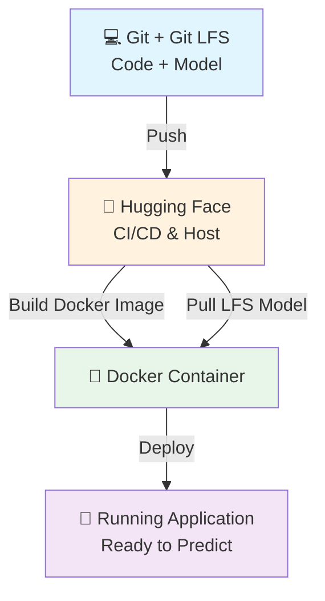

<div align="center">

# 🛡️ Phishing URL Detection System

### *Production-Ready MLOps Deployment*

LIVE API DEMO: https://huggingface.co/spaces/Akshit315/phishing-classifier/
</div>

---

## 📋 Overview

This project provides a **real-time API** for classifying URLs as legitimate or malicious based on **30 distinct features**. Built with a professional MLOps architecture, the model artifact is version-controlled and decoupled from the main application code.

✨ **Key Features:**
- 🔍 Real-time phishing URL detection
- 📊 Batch processing capabilities
- 🎯 30+ feature extraction points
- 🚀 Production-grade FastAPI backend
- 🐳 Fully containerized with Docker
- 📦 Git LFS for artifact management

The live application is hosted on **Hugging Face Spaces** with automated builds and deployment from a Dockerfile.

---

## 🛠️ Technology Stack

<table>
<tr>
<td width="50%">

### Backend & API
- **Python 3.10** - Core language
- **FastAPI** - High-performance async API
- **Gunicorn + Uvicorn** - Production ASGI server

### Data & ML
- **Pandas & NumPy** - Data manipulation
- **Scikit-learn** - ML inference pipeline

</td>
<td width="50%">

### MLOps & Deployment
- **Docker** - Full containerization
- **Git LFS** - Large file management
- **Hugging Face Spaces** - CI/CD & hosting

### Frontend Demo
- **HTML5/CSS3** - Clean UI
- **Vanilla JavaScript** - Fetch API integration

</td>
</tr>
</table>

---

## 🏗️ Architecture

Our MLOps pipeline leverages Git LFS as an artifact store, seamlessly integrated into the Docker build process:



---

## 🚀 Running the Application

### 1️⃣ Production (Live Demo)

The application is **publicly accessible** and automatically deployed:

🔗 **[Live API Documentation](https://huggingface.co/spaces/Akshit315/phishing-classifier/docs)**

> A `git push` to the Hugging Face remote triggers automatic Docker build and deployment.

---

### 2️⃣ Local Run with Docker (Recommended)

**Perfect mirror of production environment**

#### Prerequisites
```bash
# Install Git LFS
git lfs install
```

#### Setup & Run
```bash
# 1. Clone the repository
git clone https://github.com/akshitbhardwaj315/Phishing_classifier.git
cd Phishing_classifier

# 2. Build Docker image
docker build -t phishing-api .

# 3. Run container
docker run -d -p 8000:8000 --name phishing-app phishing-api
```

✅ **Access the app:** http://127.0.0.1:8000/docs

---

### 3️⃣ Local Development (Python)

**For debugging and development**

```bash
# 1. Clone with LFS (as shown above)

# 2. Create virtual environment
python3 -m venv venv
source venv/bin/activate  # On Windows: venv\Scripts\activate

# 3. Install dependencies
pip install -r requirements.txt

# 4. Run the application
python main.py
```

✅ **Access the app:** http://127.0.0.1:8000/docs

---

## 📚 API Documentation

### Endpoints

| Method | Endpoint | Description |
|--------|----------|-------------|
| `GET` | `/health` | Health check status |
| `POST` | `/predict-url` | Single URL analysis (JSON) |
| `POST` | `/predict-multi-url` | Batch URL analysis (CSV) |
| `POST` | `/predict` | CSV file upload analysis |

> 📖 **Full interactive docs:** [https://huggingface.co/spaces/Akshit315/phishing-classifier/docs](https://huggingface.co/spaces/Akshit315/phishing-classifier/docs)

---

## 💡 Example Usage

### Python Script

```python
import requests

# Live Hugging Face Space URL
BASE_URL = "https://akshit315-phishing-classifier.hf.space"

# Single URL analysis
try:
    response = requests.post(
        f"{BASE_URL}/predict-url",
        json={'url': 'https://example-phishing-site.com'}
    )
    response.raise_for_status()
    
    result = response.json()
    print(f"Classification: {result['prediction']}")
    print(f"Status: {result['status']}")

except requests.exceptions.RequestException as e:
    print(f"API request failed: {e}")
```

### cURL Commands

**Quick single URL analysis:**
```bash
curl -X POST "https://akshit315-phishing-classifier.hf.space/predict-url" \
  -H "Content-Type: application/json" \
  -d '{"url": "https://example.com"}'
```

**Batch processing:**
```bash
curl -X POST "https://akshit315-phishing-classifier.hf.space/predict-multi-url" \
  -H "Content-Type: application/json" \
  -d '{"urls": ["https://google.com", "https://example.com"]}' \
  -o results.csv
```

---

## 📁 Project Structure

```
phishing-detection/
├── 📄 .dockerignore          # Docker ignore rules
├── 📄 .gitattributes         # Git LFS configuration
├── 🐳 Dockerfile             # Container recipe
├── 🚀 main.py                # FastAPI entry point
├── 📋 requirements.txt       # Python dependencies
├── 📖 README.md              # This file!
├── 🤖 model.pkl              # ML model (Git LFS)
│
├── 📂 src/
│   ├── 📂 components/
│   ├── 📂 pipeline/
│   │   ├── predict_pipeline.py    # Model inference
│   │   └── train_pipeline.py      # Model training
│   ├── 📂 utils/
│   ├── exception.py
│   └── logger.py
│
└── 📂 templates/             # Frontend demo files
```

---

## 🎓 Model Training

> ⚠️ Training occurs **offline** and is not exposed through the API for security reasons.

### Training a New Model

```python
# 1. Prepare your labeled dataset (e.g., phising.csv)

# 2. Run the training pipeline
python -c "from src.pipeline.train_pipeline import TrainingPipeline; \
           pipeline = TrainingPipeline(); \
           pipeline.run_pipeline()"

# 3. This generates a new model.pkl file
```

### Deployment Process

1. **Commit the new model:**
   ```bash
   git add model.pkl
   git commit -m "Update trained model"
   ```

2. **Push to trigger deployment:**
   ```bash
   git push huggingface main  # Triggers automatic rebuild
   ```

> Git LFS automatically handles large file uploads. Pushing to the Hugging Face remote triggers a new build and deploys your updated model.

---

## 📞 Contact

<div align="center">

**Akshit Bhardwaj**

[](mailto:akshitbhardwaj315@gmail.com)
[](https://github.com/akshitbhardwaj315)

</div>

---

<div align="center">

### ⭐ Star this repo if you find it helpful!

Made with ❤️ by Akshit Bhardwaj

</div>